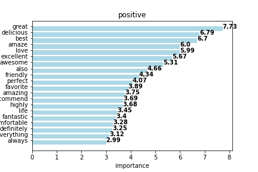

# basicNLP

## Abstract

In this project we use basic natural language processing (NLP) techniques to classify text data and generate insights. Reviews from a public data set [Yelp dataset](https://www.yelp.com/dataset/) are compiled, preprocessed, and converted to sparse matrix format using a bag of words model. The model is trained and cross-validated on accuracy, sorting reviews into positive, neutral, and negative categories based on keywords. Various classification models are compared. A look into the model output and parameters gives insight onto key parameters that have the greatest influence on prediction.

## Data Gathering & Pre-Processing Steps

The Yelp dataset is offered as a series of large, compressed JSON files. These files were downloaded, uncompressed, formatted and inserted into a SQLite database. Due to the large size of the review dataset, the review table was limited to approximately **50MB** in size. This gave a reasonable file size to work with while also providing us with an adequate number of reviews.

A sample of our review table is shown below: 

From this SQlite data source we can extract relevant information using Python libraries such as _sqlite3_ and _pandas_ for further analysis.

## Pre-Processing Techniques

The first step in our pipeline is to remove all stop words i.e. words that are common to the language and provide no useful information. The NLTK Python library provides an english stop word collection of 179 words which we filter out from each of our reviews.

Next we consider how to normalize our words with respect to tense, context and inflection. Consider the words **caring**, **cared**, and **cares**; clearly here the base form is **care** and ideally we would be able to convert all instances of the derivative words to this base form. 

Natural language processing offers two techniques to deal with this problem: **stemming** and **lemmatization**. Stemming is a cheaper computational process that uses heuristic decisions to cut down suffixes of words whereas lemmatization uses the context of the word within a sentence to understand the correct derivative form. 

The most common stemming technique is Porter's algorithm for suffix stripping (Porter, 1980) which is a 5-step process that truncates words based on the presence of vowel consonant combinations present in the word. This technique is reasonably fast but by Porter's own admission is not necessarily linguistically robust for example the word 'replacement' is trimmed to 'replac' by this approach. 

Lemmatization requires a mapping of words to the Part of Speech, or POS, that it represents, obviously immediately increasing the time complexity of any algorithm. Our choice of lemmatizer is the **WordNet** lemmatizer, one of the most comprehensive available for the english language.

In our implementation we use the **TextBlob** library to first map the words to the POS using the Penn Corpus Tag delineation before converting to to a WordNet tag to use the WordNet lemmatizer, this seemingly unnecessary intermediate step allowed us to borrow high-performing source code from the TextBlob library while using our own code to use the WordNet lemmatizer optimally. 

## Building a Design Matrix

With this initial processing complete we can move to the creation of our matrix of features. We produced two types of matrix, **Document-Term** and **TF-IDF**. 

### Document-term Matrix
The document-term matrix is essentially a bag of words model that tracks the occurences of each word in each document, in this case, in each review. This model is basic and doesn't account for grammar or word order. 

### TF-IDF
The TF-IDF (term frequency-inverse document frequency) matrix tracks a different metric the TF-IDF, which is slightly more useful than just the word occurence. TF-IDF matrix is the product of two statistics, the term frequency and the inverse document frequency. The term frequency is a measure of how frequently a word appears in a document, there exist numerous calculations for both statistics and the below examples are from the _sklearn_ Python library, which we used for this project. 

The term frequency, as mentioned, is just the sum of the terms in any given document.

$$ tf(t, d) = \sum_{t \in d} t   $$ 

The inverse document frequency is given by: 

$$ idf(t) = ln(\frac{N + 1}{df(t) + 1}) + 1 $$

Where $df(t)$ is the number of documents containing term $t$ and $N$ is the total number of documents. The effect of these $+1$ terms on each part of the calculation simulates an extra document added to the data set that contains one instance of every term. This prevents any division by zero errors in our calculations. 

Words that are common in every document would not rank high even if they appear many times.

## Feature Selection

Both the document-term and TF-IDF matrices are large and sparse which could lead to difficulties with various classification algorithms, as such we explore various examples of dimensionality reduction and feature selection.

Under vector representation, the word matrix only required approximately 500 features to reach accuracies of 80% - additional features provided diminishing increases in accuracy. See chart _n_features_. Once the top most frequent or most impactful words (TF-IDF) are identified, the remaining features do not influence the classification as significantly. This threshold approach was what we ultimately used, but we also explored alternative avenues of feature selection and dimensionality reduction.

### Curse of Dimensionality 

A reason to reduce the dimensions of our feature matrix is motivated by the so-called 'curse of dimensionality'. 

Consider a one-dimensional axis from [0, 1], by definition points on the axis can be at maximum unit 1 distance apart. If we expand this to two dimensions with an X and Y axis, the maximum distance units can be apart is still unit 1 distance, but in two dimensions, points could be at $[0, 1]$ and $[1, 0]$ or $[0, 0]$ and $[1, 1]$. We see that while the distance metric has not changed we have introduced the possibility of significantly more space in our feature space. 

Expanding to higher dimensions, the sparsity of a many featured dataset becomes obvious and we see that the vast majority of a high-dimensional feature space is empty. Giving us difficulty in training many machine learning models, particularly when geometric distance measures (such as euclidean distance) are used. 

### Principal Component Analysis 

For a preview, we can visualize the top 2 principal components of our feature matrix to see how separable the data is.

After performing PCA and extracting the top two components we can plot the positive, negative, and neutral reviews as 2-dimensional KDE (kernel density estimation) heatmaps. Examples are shown below for the document-term matrix: 

We see here there is _some_ degree of visual separation viewable in the 2 principal component space.

### Mutual Information

By performing mutual information regression using the _sklearn_ Python library we are able to produce a mutual information 'score' for each of our features. That is to say we are able to identify words with the highest relevance to predicting a given score count. 

With a score assigned to each variable, we can choose a series of arbitrary thresholds that reduce the size of our feature matrix. 

# Classification 

Once the list of preprocessed reviews are in vector representation which we call the word matrix, we are ready to train models to perform classification. The dimensions of the word matrix are $m$ x $n$ where $m$ are individual reviews and $n$ are the extracted features.

## Classification Model Comparison

A multitude of classification models were trained on this dataset. Logistic regression, Naive Bayes, SVM linear, SVM with radial basis function kernel, Classification and Regression Tree, Random Forest, and Neural Network were used to classify positive, negative, and neutral reviews. For these models, the accuracy was compared over the number of features. Most models performed reasonably, reaching accuracies close to 80% with enough features and reviews. Given that the test set has 686/1000 positive reviews, a baseline of 68.6% is expected for a classifier which predicts all positive.

The accuracy of selected models are compared over the number of reviews in the training set to see how the size of the data set affects performance. Just like above, a multitude of classification models were trained. Naive Bayes performed the best on limited information (when number of reviews <250). It is possible that with a larger dataset the classification performance can be increased. This is of course dependent on the tradeoff between the cost of data collection and computational time versus increased prediction performance.

## Logistic Regression with Bag of Words

### Method, tuning, metrics

Given most of the models reached about 80% accuracy, we chose to examine logistic regression more closely since the model allows for interpretation of the feature coefficients. Multiclass logistic regression was used - A one-vs-all approach is used to calculate probabilities of reviews falling into each of the three classes (positive (+1), neutral (0), or negative (-1)).

If there are m reviews, n features, and c in K classes:

Given a $m$ x $n$ word matrix $X$, a $m$ x $k$ $Y$ matrix, we can find a $n$ x $k$ matrix $W$ that holds the coefficients for our logistic regression. Compared to binary classification, this multi classification chooses the class with the highest probability:

$$ p(y_{i}=c|x_{i}w_{c}) = \frac{1}{1+e^{-w_{c}^{T}x_{i}}}  $$

$$y_{i} = argmax_{c}(w_{c}^{T}x_{i})   $$

In multinomial logistic regression, $W$ has 1 column for each label: positive (+1), neutral (0), or negative (-1). Probabilities are calculated with:

$$ P(y_{i}=c|x_{i}w_{c})= \frac{exp(x_{i}w_{c}^{T})}{\sum_{c=1}^{K}exp(x_{i}w_{c}^{T})} $$
The probabilities are normalized over the probability sum over all classes. The class assigned is ultimately the class $c$ which has the highest probability.

Regularization is also added to the loss function for finding theta. Regularization is especially important in such data sets where there are many features (words) and the matrix is sparse. A L2 regularization is used as it is possible to remove features. 

$$ \theta = argmax [\sum_{i=1}^{m}log P(y_{i}|x_{i})]-C\sum^{n}_{j=1} \theta^{2}  $$

To find the best parameters of the logistic regression model, the data set is shuffled and split 80/20 into a training set and a test set. 5-fold cross validation is used on the training set to find the optimal regularization constant C.

We define the performance metric to be accuracy of predictions or % of correct classifications. In this application we want to train the classifier to correctly classify the highest percentage of reviews. Using the optimal C found through cross validation we find the model has a 80% accuracy. 

Given that the test set has 686/1000 positive reviews, or 68.6%, this classifier is a significant improvement. According to f1-score, the harmonic mean between precision and recall, the classifier performs best on positive reviews but struggles with identifying neutral reviews.

ROC and AUC is another metric to be considered if we are comparing model performance for just positive and negative reviews.

### Interpretation

It is important to interpret the model performance in terms of the features when possible to see how the model matches up with intuition. After fitting the features to the training set, the regression coefficients are extracted to see the relative importance of features for each class. The top 20 important features contributing to each class are shown below.

|                          
|                          
|                          

The output shows the relative importance of words for each class. Important features for the negative class include 'worst','terrible','horrible','gross','disgusting'. This makes sense, as if found in a review, these words unambiguous signs of a bad review. Important features for the positive class include 'excellent','amazing','friendly','wonderful', which are undoubtedly signs of a good review. The important features for the neutral class also make sense which include 'ok','probably','alright' which are signs of a mixed experience. However, some of the features are not as strong indicators such as 'korean' and 'steam'. This explains why the classifier has a more difficult time with neutral reviews.

The model is based on 'bag of words' and has limitations - words are treated as independent features. The same methods were used with the TF-IDF matrix and resulted in similar performance with an accuracy around 80%. Improvements could be done by leveraging the co-occurence of words. Also the model may face difficulty when encountering words not seen in the training set. Some potential improvements to this model could involve leveraging semantics, or word meanings, that are picked up from a large pre-trained data set. However, as a proof of concept, this type of analysis should be applicable to general document classification using textual data. 

!f2
[f2]: http://chart.apis.google.com/chart?cht=tx&chl=E_k=mc^2-m_0c^2
